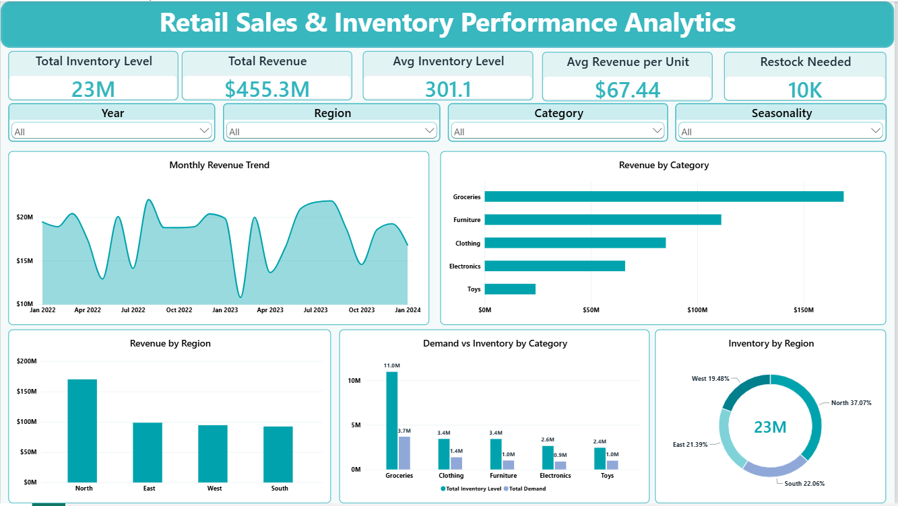

# Retail Sales & Inventory Performance Analytics

A beginner-friendly data analytics project that uses **Python, MySQL and Power BI** to understand a retail business: where the money comes from, where stock may run short, and how promotions and discounts relate to sales.



## 1. Introduction

This project looks at retail sales and inventory data to answer simple business questions about categories, stores, regions, promotions and discounts. I took it from raw data to business insights and an interactive dashboard.

## 2. Business Problem

A retail business needs a simple way to answer questions like:

- Which categories and regions earn the most revenue?
- Where is inventory under pressure?
- Which stores and products perform better?
- Do sales change by month or season?
- How do promotions and discounts relate to sales?

The goal is one clear view of sales, demand and inventory, so managers know where to look closer.

## 3. Dataset

Source: **Retail Store Inventory and Demand Forecasting** dataset from Kaggle. It is a synthetically generated retail dataset, so the results show the method and are not real company results.

[Dataset on Kaggle](https://www.kaggle.com/datasets/atomicd/retail-store-inventory-and-demand-forecasting)

| Item | Detail |
|---|---|
| Rows | 76,000 |
| Columns | 16 original, 19 in the final project data |
| Stores / Products | 5 stores, 20 product IDs |
| Categories | Clothing, Electronics, Furniture, Groceries, Toys |
| Regions / Seasons | 4 regions, 4 seasons |
| Dates | 1 January 2022 to 30 January 2024 |

The currency is not given in the data. Dollar ($) signs are used only for display.

## 4. Tools Used

| Tool | What I used it for |
|---|---|
| Python (Pandas, Matplotlib) | Cleaning data, creating new metrics, exploring the data |
| MySQL | Answering business questions and checking the final KPIs |
| Power BI and DAX | KPI calculations and the interactive dashboard |

## 5. What I Did

`Raw Data → Python → Cleaned CSV → MySQL → Power BI`

- **Python:** cleaned the data, checked duplicates and data types, created new metrics and saved the final CSV.
- **SQL:** loaded the CSV into MySQL and answered questions about months, categories, products, stores, regions, inventory, promotions, discounts and seasons. I also used SQL to check the final KPIs.
- **Power BI:** built KPI cards, filters (slicers) and charts in one dashboard page.

## 6. Metrics I Created

```text
Revenue                    = Units Sold × Price
Revenue per Unit           = Revenue ÷ Units Sold
Inventory Gap              = Inventory Level − Units Sold
Demand-to-Inventory Ratio  = Demand ÷ Inventory Level

## 7. What I Found

These are descriptive findings from the project. They show patterns in the data and are not proof of cause and effect.

- **About 1 in 7 rows (13.68%)** have demand above inventory. This is a signal to review stock, not a confirmed stockout.
- **Clothing** has the highest restock rate at **19.42%**, while **Furniture** has the lowest at **7.84%**.
- **Groceries** generate the highest revenue at **37.09%** of total revenue and account for **46.32% of units sold**.
- **Furniture** generates higher value per unit at about **$126 per unit**, contributing **24.44% of revenue** from **13.05% of units**.
- **North** generates the highest regional revenue at **37.34%**, but it also contains **2 of the 5 stores**.
- **Promotion rows** have higher average units sold (**103.10 vs 81.83**) and higher restock pressure (**19.56% vs 10.79%**).
- **2023 revenue** was approximately **2.66% lower than 2022**.

## 8. What I Learned

- How to clean and prepare a retail dataset for analysis.
- How to create useful business metrics from raw data.
- How to use **Python** for data preparation and exploratory analysis.
- How to use **MySQL** to answer business questions and validate results.
- How to build **KPIs and an interactive dashboard in Power BI**.
- How to keep the same business numbers consistent across Python, SQL and Power BI.
- How to explain data findings without treating descriptive relationships as cause and effect.

## 9. What Can Be Improved

This project can be extended further by:

- Adding **cost and profit data** to analyze margins and profitability.
- Adding **supplier lead time** to improve inventory planning.
- Adding **customer-level data** for customer and product behavior analysis.
- Adding more historical data for stronger **trend and seasonal analysis**.
- Building a demand forecasting model when the project moves beyond descriptive analytics.
- Adding more business KPIs based on real retail requirements.

## 10. Limitations

- The dataset is synthetic and does not represent a specific real retail company.
- Cost, profit, customer and supplier lead-time data are not available.
- Promotion and discount variables overlap, so their individual effects cannot be separated reliably.
- Restock Needed is a review signal, not a confirmed stockout or actual purchase quantity.
- The dataset does not document a currency, so `$` is used only for display.

