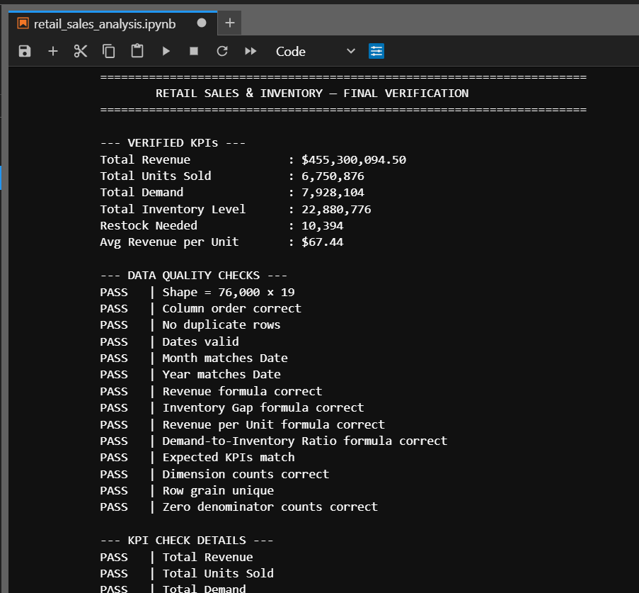
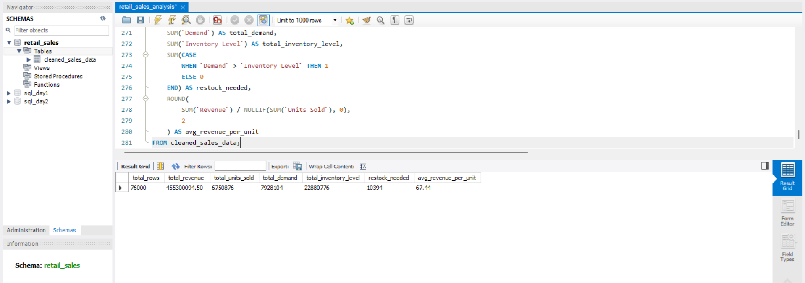

# Retail Sales & Inventory Performance Analytics

**Tools:** Python (Pandas, NumPy, Matplotlib) · MySQL 8 · Power BI · DAX  
**Domain:** Retail Sales and Inventory Analytics  
**Project type:** Descriptive and diagnostic analytics


> **Project takeaway:** I analyzed 76,000 retail observations to understand revenue patterns and identify where recorded demand exceeded available inventory. Demand exceeded inventory in **10,394 observations (13.68%)**, with Clothing showing the highest review rate at **19.42%**.

> **Dataset note:** This project uses a synthetically generated retail dataset from Kaggle. The results demonstrate an analytics workflow and should not be interpreted as verified performance data from a real retailer.

## 1. Business Problem

Retail teams need to understand which categories and regions contribute most to revenue, how performance changes over time, and where recorded demand may exceed available inventory. This analysis links those patterns to areas for review without treating every inventory gap as a confirmed stockout.

The project investigates:

- Which categories, products, stores, and regions contribute most to revenue?
- How do sales and revenue vary over time and across retail segments?
- How often does recorded demand exceed inventory, and which categories show the highest review rates?
- How do sales observations during promotion periods compare with non-promotion observations?

## 2. Dataset and Source

The source is the [Retail Store Inventory and Demand Forecasting dataset on Kaggle](https://www.kaggle.com/datasets/atomicd/retail-store-inventory-and-demand-forecasting). The prepared analysis dataset contains **76,000 rows and 19 fields**, covering **1 January 2022 through 30 January 2024**.

| Dataset characteristic | Detail |
|---|---:|
| Source fields | 16 |
| Prepared analysis fields | 19 |
| Stores | 5 |
| Product IDs | 20 |
| Product categories | 5 |
| Regions | 4 |
| Seasons | 4 |

The source fields include date, store and product identifiers, category and region, inventory level, units sold, units ordered, price, discount, promotion, seasonality, weather, competitor pricing, epidemic indicator, and demand. The prepared dataset excludes Weather Condition, Competitor Pricing, and Epidemic, and adds calculated fields for revenue and inventory-demand analysis.

**Currency note:** The source does not specify a monetary unit. The `$` symbol in the dashboard and results is a display convention only; it is not a verified USD denomination.

## 3. Tools and Methodology

### Python: data preparation and exploratory analysis

- Loaded and inspected the source data with Pandas.
- Checked data types, missing values, duplicates, and date consistency.
- Parsed dates and derived `Month` and `Year` fields.
- Calculated revenue and inventory-demand measures, then exported the prepared data for SQL and Power BI.
- Used grouped summaries, charts, and correlations to explore sales, revenue, demand, and inventory patterns.

### Derived measures

```text
Revenue = Units Sold × Price
Revenue per Unit = Revenue ÷ Units Sold
Inventory Gap = Inventory Level − Units Sold
Demand-to-Inventory Ratio = Demand ÷ Inventory Level
```

Revenue is calculated as `Units Sold × Price`, before the separate `Discount` field is applied. Discount is analyzed as a distinct dimension. Ratio fields are left blank when their denominator is zero.

An observation is flagged for inventory review when `Demand > Inventory Level`. This is a screening signal for further investigation, not proof of a stockout or a calculation of how many units should be reordered.

### MySQL: validation and business questions

- Loaded the prepared 19-column CSV into `cleaned_sales_data`.
- Checked the row count and reconciled headline KPIs.
- Used aggregation, `CASE`, CTEs, and ranking/window functions to compare patterns by month, category, product, region, store, promotion, discount, and seasonality.
- Built a product-prioritization query using revenue rank and relative demand/inventory indicators.

### Power BI and DAX: reporting

Built an interactive dashboard with KPI cards, slicers, revenue trends, category and regional comparisons, and demand-versus-inventory views.

## 4. Key Results

| KPI | Result |
|---|---:|
| Total gross revenue (before discounts) | **$455,300,094.50** |
| Total units sold | **6,750,876** |
| Total demand | **7,928,104** |
| Total inventory level across observations | **22,880,776** |
| Average inventory level per observation | **301.06** |
| Average revenue per unit (total revenue ÷ total units sold) | **$67.44** |
| Observations where demand exceeds inventory | **10,394 of 76,000 (13.68%)** |
| Gross revenue in 2022 | **Approximately $222.2M** |
| Gross revenue in 2023 | **Approximately $216.3M** |
| Revenue change, 2023 vs. 2022 | **−2.66%** |
| Highest seasonal share of revenue | **Winter — 27.55%** |
| Groceries share of gross revenue | **37.09%** |
| North region share of gross revenue | **37.34% — combined across two stores** |

The dataset source does not specify a currency. Gross revenue is calculated as `Units Sold × Price`, before discounts. The displayed average revenue per unit (**$67.44**) is total gross revenue divided by total units sold; the unweighted mean of the row-level `Revenue per Unit` field is **67.73**.

### Key Findings

1. **Inventory review flags occur in a meaningful share of observations:** demand exceeds recorded inventory in **10,394 observations (13.68%)**. This is a review signal, not confirmation of a stockout or a precise reorder quantity.
2. **The review rate varies by category:** Clothing is highest at **19.42%**, while Furniture is lowest at **7.84%**. The dashboard's **Restock Needed** measure flags observations where `Demand > Inventory Level`.
3. **Revenue varies by category and season:** Groceries contributes **37.09%** of gross revenue, while Winter contributes the highest seasonal share (**27.55%**).
4. **Year and regional comparisons need context:** 2023 revenue was approximately **2.66% below** 2022 (about **$216.3M vs. $222.2M**). North's **37.34%** revenue share combines two stores, S001 (**19.74%**) and S005 (**17.60%**); the regional total should not be interpreted as stronger per-store performance. January 2024 is a partial month and should not be compared directly with a full year.

### Promotion comparison

Average units sold are **103.10** for promotion observations versus **81.83** for non-promotion observations—approximately **26% higher** in the promotion group. This is an observational comparison, not proof that promotions caused the difference; product mix, timing, and other factors may contribute.

## 5. Dashboard

The Power BI report includes:

- KPI cards for revenue, units sold, demand, and inventory-related measures.
- Slicers for year, region, category, and seasonality.
- Monthly revenue trends and revenue by category and region.
- Demand-versus-inventory comparisons by category and inventory by region.

## 6. Business Recommendations

- **Prioritize inventory reviews:** start with Clothing, which has the highest demand-exceeds-inventory review rate at **19.42%**; inspect the affected store-product combinations before adjusting replenishment.
- **Review demand before promotion periods:** compare inventory and sales for similar products, stores, and time periods before deciding whether inventory buffers need adjustment.
- **Monitor revenue by category and season:** track Groceries, which contributes **37.09%** of gross revenue, and investigate the Winter peak (**27.55%** of revenue).
- **Compare regional and store performance carefully:** North's **37.34%** share combines two stores and does not by itself indicate stronger per-store results. Compare store-level metrics as well.
- **Use inventory flags as leads, not automatic orders:** validate demand and inventory records and consider supplier lead times and replenishment constraints before determining order quantities.
- **Interpret promotion comparisons cautiously:** compare similar categories, stores, and periods to reduce the risk of mistaking a difference in product mix for a promotion effect.

## 7. Validation and Limitations

The notebook's saved verification output reports passing checks for the expected **76,000 × 19** shape, column order, duplicate rows, date validity, Month/Year consistency, derived formulas, expected KPIs, dimension counts, unique row grain, and zero-denominator handling. The SQL import was also checked in MySQL Workbench, where the row-count query returned **76,000** and the headline KPI query matched the notebook's results.

- The dataset is synthetically generated and does not represent verified results from a named retailer.
- The source does not specify a monetary unit; `$` is a display convention only.
- `Demand > Inventory Level` is a review signal, not evidence of a confirmed stockout or the number of units that should be reordered.
- No cost or profit field is included, so gross profit and margin cannot be calculated.
- Promotion and discount comparisons are observational and do not establish causal effects.
- January 2024 is a partial month and should be compared carefully with complete months.

### Verification screenshots

**Python verification**



**SQL verification**



## 8. Project Files

- [Prepared CSV](data/cleaned_sales_data.csv)
- [Python analysis notebook](python/retail_sales_analysis.ipynb)
- [MySQL analysis script](sql/retail_sales_inventory_performance.sql)
- [Power BI dashboard file](powerbi/Retail_Sales_Inventory.pbix)
- [Dashboard screenshot](assets/dashboard.png)
- [Python verification screenshot](assets/python_verification.png)
- [SQL verification screenshot](assets/sql_verification.png)

## 9. Reproducibility

1. Download the raw dataset from the [Kaggle source](https://www.kaggle.com/datasets/atomicd/retail-store-inventory-and-demand-forecasting).
2. Save or rename the original CSV to `sales_data.csv` so it matches the notebook's input path, or update the notebook to match your filename.
3. Run `python/retail_sales_analysis.ipynb` from top to bottom to inspect the source, clean the data, calculate derived measures, and export the prepared CSV.
4. Before running the MySQL import, open the SQL script and replace its Windows `LOAD DATA LOCAL INFILE` path with the full local path to your `cleaned_sales_data.csv` file. The server and client must both allow local data loading.
5. The full SQL script drops and recreates `cleaned_sales_data` before importing; do not run it if you need to preserve the table's current rows. Run the validation and business-question queries after import.
6. Open `powerbi/Retail_Sales_Inventory.pbix` and compare its headline KPIs with the notebook and SQL results.

---

*This project demonstrates a descriptive analytics workflow using a synthetic dataset. Inventory flags are investigation leads, not confirmed stockouts or automatic replenishment instructions.*
